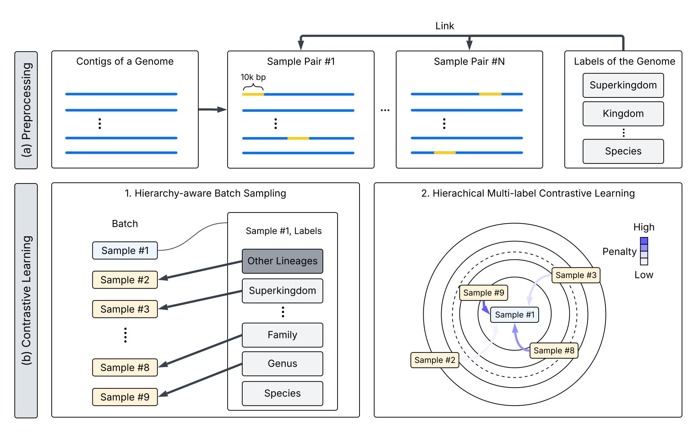
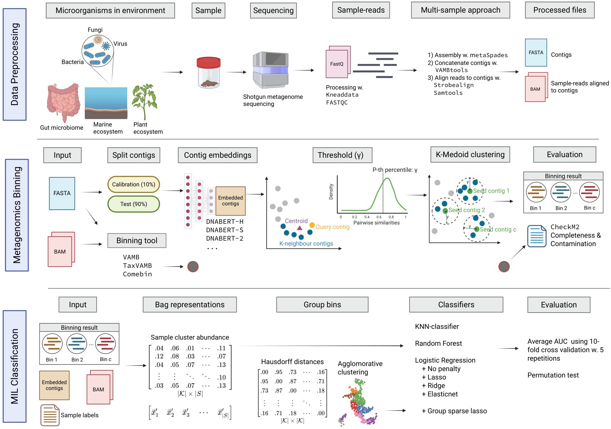
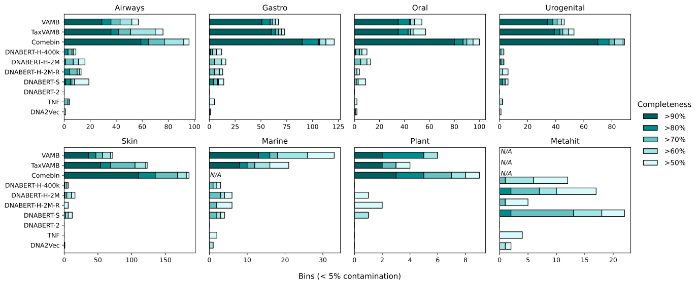
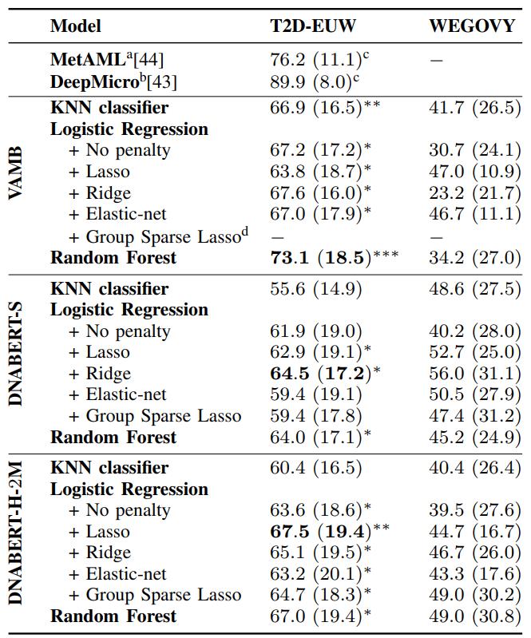
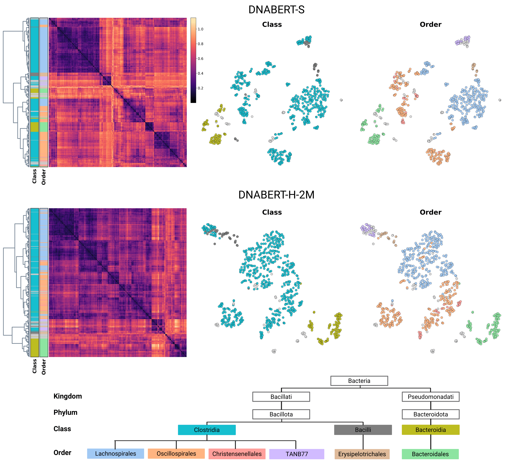

# NEW TITLE
By Anders Hjulmand, Andreas Flensted, Eisuke Okuda.

Master Thesis in Data Science @ IT-University of Copenhagen.


## Contents
- [NEW TITLE](#new-title)
  - [Contents](#contents)
  - [1. Introduction](#1-introduction)
  - [2. Model](#2-model)
  - [3. Setup environment](#3-setup-environment)
  - [4. Quick start](#4-quick-start)
  - [5. Model Training](#5-model-training)
  - [6. Metagenomics binning](#6-metagenomics-binning)
  - [7. Phenotype Classification using Multiple Instance Learning](#7-phenotype-classification-using-multiple-instance-learning)
  - [8. Results](#8-results)

## 1. Introduction
DNABERT-H is a Genomic Language Model (gLM) based on [DNABERT-S](https://github.com/MAGICS-LAB/DNABERT_S) and trained using Hierarchical Multi-label Contrastive Learning from [Use All The Labels](https://arxiv.org/abs/2204.13207).
Biological classification of genomes follows a hierarchical taxonomy, ranging from the broadest category - *superkingdom* (e.g. Eukarya) - down to the most specific level, *species* (e.g. Homo sapiens). 
DNABERT-H leverages all labels in the taxonomic hiearchy during training, and thereby creates embeddings that treflect evolutionary relationships between species. DNABERT-H is trained using bacteria, virus, and fungi genomes, and can be applied to metagenomics tasks such as metagenomics binning and phenotype classification. 


**Pretraining procedure:**  
<p align="center">
  
</p>


## 2. Model

The pre-trained model is available [here](https://figshare.com/articles/dataset/DNABERT-H-2M/29145308) . 

Place the model in the directory `train/dnaberth_weights/dnaberth_2m`.


## 3. Setup environment

Clone the repository:
```bash
git clone https://github.com/affo98/DNA-language-models-and-GLP1-microbiome-changes.git
cd DNA-language-models-and-GLP1-microbiome-changes
```

If conda is not installed, run the following code to install it:
```bash
chmod +x get_conda.sh
bash get_conda.sh
source ~/.bashrc
```

Place the model in the directory `train/dnaberth_weights/dnaberth_2m`.


## 4. Quick start

Setup conda environment.

```
conda env create -f binning/envs/binning.yml && conda activate binning 
pip uninstall -y triton
```

Load the model using the [transformers](https://github.com/huggingface/transformers) and backbone [DNABERT-S](https://github.com/MAGICS-LAB/DNABERT_S).

```
import torch
from transformers import AutoTokenizer, BertConfig, AutoModel

tokenizer = AutoTokenizer.from_pretrained("zhihan1996/DNABERT-S", trust_remote_code=True)
config = BertConfig.from_pretrained("zhihan1996/DNABERT-S")
model = AutoModel.from_pretrained("zhihan1996/DNABERT-S", config, trust_remote_code=True)
model.load_state_dict(torch.load(train/dnaberth_weights/dnaberth_2m/pytorch_model.bin))
```

Run inference with model to get embeddings of a DNA sequence.

```
dna = "ATGCGTACCTGAACTGGTACCGTATCGAGGCTTACCGGATAGCTTGAACCGTACGTTAGGCTAGCTTACGGAATGCCGT"
inputs = tokenizer(dna, return_tensors = 'pt')["input_ids"]
hidden_states = model(inputs)[0] # [1, sequence_length, 768]

# embedding with mean pooling
embedding_mean = torch.mean(hidden_states[0], dim=0)
print(embedding_mean.shape) # expect to be 768
```

## 5. Model Training

The training procedure for DNABERT-H is described in the folder `train`. 


## 6. Metagenomics binning

We assess the performance of our model on metagenomics binning. This task is essentially a clustering problem where the number of clusters is unknown. The goal is to identify clusters that correspond to individual genomes - known as metagenome-assembled genomes (MAGs).

The implementation details are described in the folders `cami2_benchmark` and `binning`.


## 7. Phenotype Classification using Multiple Instance Learning 

As a second experiment, we assess the performance of our model on phenotype classification using a Multiple Instance Learing (MIL) framework. 

The implementation details are described in the folders `phenotype_mil` and `binning`.

The pre-processing of data for phenotype classification is described in the folder `ngs_pipeline`.


<p align="center">
  
</p>


## 8. Results

**Metagenomic binning**
DNABERT-H did not match state-of-the-art binning tools like Comebin and VAMB in metagenomics binning, but performed similar to DNABERT-S.
<p align="center">
  
</p>

**Phenotype classification using Multiple Instance Learning**
Using our proposed MIL framework, DNABERT-H consistently outperformed DNABERT-S, although still performed worse than state-of-the-art binning tools.
<p align="center">
  
</p>

**Hierarchical taxonomy awareness**  
DNABERT-H preserves phylogenetic structures between species:  
<p align="center">
  
</p>


