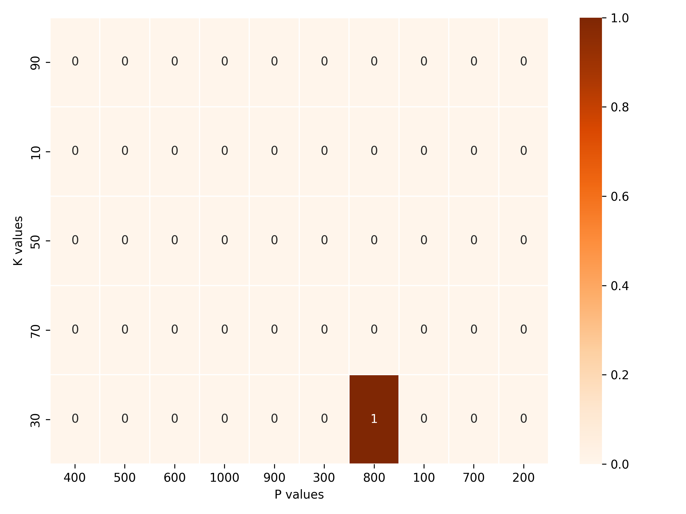
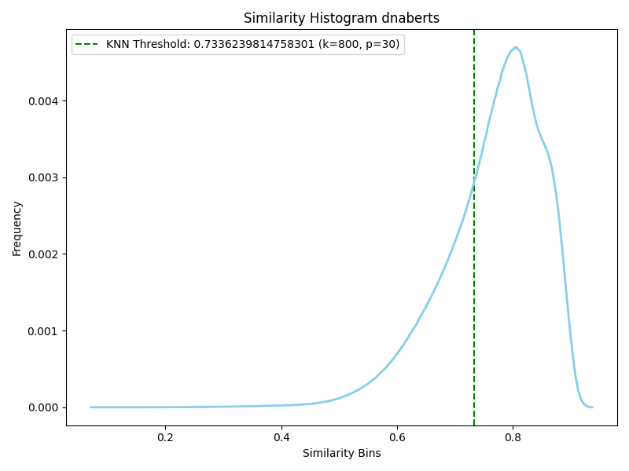
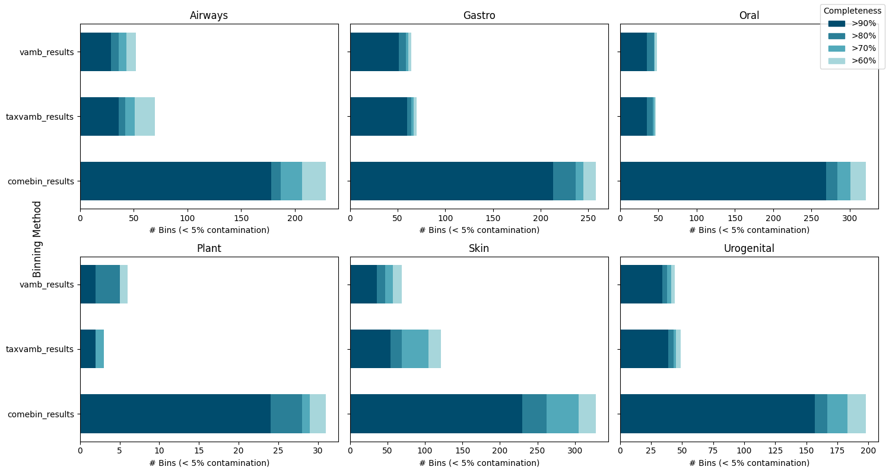
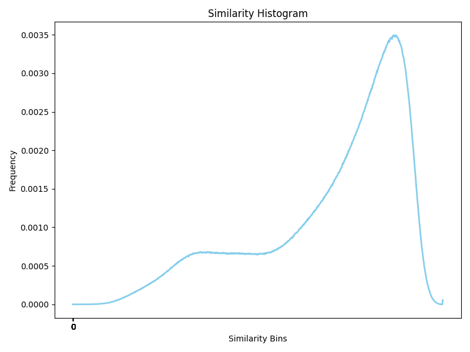
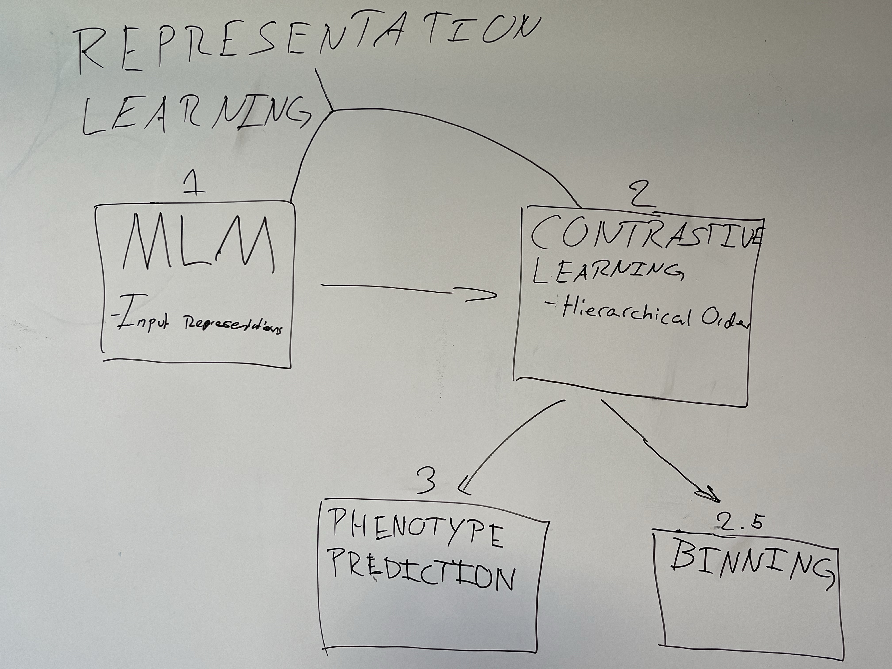

# Weekly Meeting Notes Outline

[Overleaf report](https://www.overleaf.com/project/679796b5a02b660e4f96beff)

#### Meeting Outline
* [03 April 2025](#date-30-january-2025)
* [27 March 2025](#date-30-january-2025)
* [20 March 2025](#date-30-january-2025)
* [11 March 2025](#date-30-january-2025)
* [27 February 2025](#date-30-january-2025)
* [20 February 2025](#date-30-january-2025)
* [06 February 2025](#date-30-january-2025)

#### Date: 27 March 2025

##### Who did you help this week?

##### Who helped you this week?
Inna from the HPC.

##### What did you achieve?

* Get more results from benchmarked models, e.g. Dnabert-s and TNF, in metagenomics binning.
* Tested params for training, e.g. learning rate and scheduler params. 

##### What did you struggle with?

##### Where do you need help from Veronika?

1. Selection of threshold for Kmediod. We found that the Otsu did not work, because of the histogram shapes not being two peaks. New method: Obtain threshold from KNN: for each datapoint, sample top k neighbours, calculate centroid, and calculate all similarities to centroid within the neighbourhood. Use percentile p as of histogram as threshold - similar to research project. But how to select good k and p? We have set aside 10% as validation data and searched through K=[100,200,300,...,1000] and P = [10,30,50,70,90] by using CheckM2 do determine performance. This takes a long time to run (e.g. 3 hours for one model). We get similar results as when using the threshold determined in the research project (see histogram below).
   1. Question 1: The best combination of k/p is currently the one that finds 1 good bin with less than 5/10 % contamination. See image below. This is a bit greedy since another combination could end up being better when relaxing the contamination constraint.  
   
Results on Metahit: Generally much worse results than Vamb and Taxvamb. 
{'dnaberts0_researchprojectthreshold_results': [1, 8, 11, 16, 22],
 'dnaberts250000_researchprojectthreshold_results': [1, 8, 11, 16, 22],
 'dnaberts_knn_results': [0, 3, 8, 15, 19],
 'tnf_researchprojectthreshold_results': [0, 1, 1, 1, 2],
 'tnf_results': [0, 0, 0, 1, 5]}

1. Potential clustering algorithm instead of Kmediod: HDBSCAN. What do you think about that?

#### Date: 27 March 2025

##### Who did you help this week?

##### Who helped you this week?

##### What did you achieve?

* Get first results from benchmarked models in metagenomics binning. Comebin seems too good! We need to talk to Simon's team.
* Test Bionfinformatics pipeline on full dataset
* Pre-training our model with hierarchical contrastive loss.

##### What did you struggle with?

* What is the best way to empirically define a distance threshold used by the k-medoid algorithm?
   * Theoretically we want the bottom of the valley of our histogram of pairwise distances, but practically we find it a bit up in the air. VAMB uses some loop and tries to see if numbers increase og decrease compared to some `peak_valley` variable. See below an example; TNF on Airways Short Cami2 Dataset.

##### Where do you need help from Veronika?

* What ideas would you have for defining a distance threshold empirically for clustering?

#### Date: 20 March 2025

##### Who did you help this week?

##### Who helped you this week?

* The new HPC Admin at ITU.

##### What did you achieve?

* Processing Cami2 dataset, bioinformatics pipeline, e.g. align reads to contigs, and using tools from vamb.
* Got vamb to work on a single cami2 dataset. It turns out that we did not implement vamb correctly in the research project.
* Implemented evaluation tool CheckM2 which determines completion and contamination in clusters/bins. In realistic data, there are no labels that we can use to evaluate.
* Using Snakemake for data processing flow works well. 
* Got pretty far with pre-training code, but there is some reproducibility problems. 

##### What did you struggle with?

* Other binning models have a lot of errors: Comebin, Semibin2. They are also quite heavy to run, and require a lot of compute time. It is quite time-consuming. 
* We have problems getting access to A100 80GB on Ucloud. We created a ticket to Ucloud, and talked to Inna. 

##### What would you like to work on next week?

* Finish Cami2 dataset processing and benchmark the other models on CAMI2: vamb, taxvamb, comebin, and maybe semibin2. 

##### Where do you need help from Veronika?

#### Date: 11 March 2025

##### Who did you help this week?

##### Who helped you this week?

* The new HPC Admin at ITU. 

##### What did you achieve?

* Implemented binning on GPU
* Gathered Phenotype datasets
* Got further in collecting and proessing CAMI2 data.
* Got further in pre-training code, and collected pre-training data for bacteria.
* Running pipeline for processing raw reads from multiple samples into contigs and abundances.

##### What did you struggle with?

##### What would you like to work on next week?

##### Where do you need help from Veronika?

* In pre-training, we wonder whether we should use varying length DNA sequences, or fixed length 10.000 bps. 

#### Date: 27 February 2025

##### Who did you help this week?

##### Who helped you this week?

One of Simons collegues, Jakob. He will help us implement the binning algorithm on GPU.

##### What did you achieve?

* Collected 6 phenotype datasets, i.e. reads and sample labels.
* Collected genome sequences with hiearchical labels, i.e. our pre-training data.
* Got started on the bioinformatics pipeline, i.e. how to process reads into contigs from multiple patients.

##### What did you struggle with?

##### What would you like to work on next week?

* Making a good setup on the Cluster. 
* Bioinformatics pipeline.
* Structure pre-training data.

##### Where do you need help from Veronika?

**Phenotype prediction (MIL)**:

- Comparison with other phenotype prediction models (e.g. MetAML, DeepMicro, IDMIL): Can we copy their reported results on the datasets, or should we run the models ourselves? This could be a lot of work, because models use different frameworks to process the reads. 
- Comparison of different MIL frameworks: KNN baseline, GNN, and other MIL frameworks.

#### Date: 20 February 2025

##### Who did you help this week?

##### Who helped you this week?

  - Simon Rasmussen
  - Damian 

##### What did you achieve?

**Hiearchical Contrastive Learning**
Found a hiearchical contrastive learning framework using labels: https://arxiv.org/pdf/2204.13207. 

**Mixing**
In DNABERT-S they use MI-MIX as a domain agnostic data augmentation technique, to mix up hidden representations, which should regularize the model. We thought about a) just copying the MI-MIX, to make our model comparable to DNABERT-S, b) ignoring the MI-MIX, or c) try another mixing strategy. But we also want to focus more of our time on contrastive learning and MIL.   

**MIL**
Defining our MIL and prediction setup. A bag is condidered a patient. Here is a possible outline.

1. Obtain contigs from a patient and do binning, like in our research project. This results in a dictionary that maps every contig to a cluster.
   
2. **Create cluster catalogue (CC)**: We consider every cluster an instance, and there are *k* clusters. A cluster could be represented in 4 different ways:
   1. Cluster centroid matrix $ \in R\ ^{|k|\times d}$, where every instance is the average of contig-embeddings. We can either calculate the centroid using all contigs, or only use contigs from a specific patient.
   2. Distance matrix $ \in R\ ^{|k|\times |k|}$ where each entry denotes the hausdorff distance between two clusters (like the genus-analysis in our research project). We can either calculate distances using all contigs, or only using contigs from a specific patient.
3. **Add abundance vector (AV)**: Consider that every patient has a $1 \times |k|$ vector indicating the abundance of every species for that patient. This abundance vector can be included in 3 ways; a)  multiplied by the cluster catalogue, such that each cluster is weighted by its abundance, b) used directly as input to the network with separate learned attention scores $A_a$, or c) a combination of both. There are 2 ways to compute the abundance:
   1. Frequency-based, where we count the number of contigs in a cluster, divided by the total contigs for that patient. 
   2. Weighted by contig abundance: The abundance of each contig within each patient is an important signal for phenotype prediction. Instead of simply counting contigs like in i), we can do a weighted sum using the contig abundances. 
4. **MIL framework** We can have a model with 2 inputs and 2 learned attention score-vectors. The first input to the model can be the following: A cluster catalogue (CC) weighted by the Abundance Vector $AV$ with learned attention scores $A_{cc}$

$$g[CC \times AV \times A_{cc}]$$

The second input can be the Abundance vector only, with a learned attention score $A_{av}$:

$$h[AV \times A_{av}]$$

A final transformation $l$ combines the two transformations $g$ and $h$ into the output prediction.

$$ output = l(g, h) $$

5. **Model architecture**: We are keen on trying out GNNs with MIL, based on this paper, where they cite you! https://arxiv.org/pdf/1906.04881. This incorporates relationships between species which is a nice property, and we avoid using a cnn on some matrix. 

##### What did you struggle with?

##### What would you like to work on next week?

-Acquiring data, contrastive learning, bioinformatics pipeline. 

##### Where do you need help from Veronika?

Discussion of the MIL setup.
  

#### Date: 06 February 2025

##### Who did you help this week?

##### Who helped you this week?

##### What did you achieve?

Getting more concrete ideas about scope of thesis, and what contributions we can make to DNA language models in metagenomics.

##### What did you struggle with?

##### What would you like to work on next week?

- Prepare for meeting with potential external supervisor: Simon Rasmussen, KU at February 14th.

##### Where do you need help from Veronika?

We need feedback on our Thesis scope ideas.

We generally have 3 areas of interest.

1. **MLM Pretraining**
   1. A recent paper found that randomly initialized DNA language models perform very similar to ones pretrained with MLM ([Paper](https://www.biorxiv.org/content/10.1101/2024.12.18.628606v1.full.pdf)): *"While pretraining provides double-digit improvements in computer vision and NLP, the gains in genomics are typically within 2-3% and often negative, challenging the effectiveness of current genomic pretraining approaches"*. Simply applying methods from NLP to DNA may not be suitable.
   2. Apply BART noising functions (e.g. text infilling, sentence permutattion).
   3. Change tokenization strategy to [MxDNA](https://arxiv.org/pdf/2412.13716) where tokens a NN is trained to find meaningful tokens, instead of using BPE like DNABERT.
   4. Represent DNA-sequence as a graph, e.g. where nodes are tokens and edges are attention-weights from a DNA language model, e.g. DNABERT: [TokenVizz](https://arxiv.org/pdf/2408.07180).
   5. Use pointwise mutual information to selectively mask most correlated tokens with an anchor token: [paper](https://arxiv.org/pdf/2408.07180).
   6. Use evolutionary information to guide the MLM, and detect sequence variants [GPN-MSA](https://www.biorxiv.org/content/10.1101/2023.10.10.561776v1.full).
   7. None of the genomic tokenization strategies have resulted in substantial performance improvements.
2. **Improve on contrastive learning from DNABERT-S**.
   1. DNABERT-S uses weighted SimCLR, with positive samples from same species, and negative samples from another species. Problem is that two species that are very biologically related could end up far apart in embedding space.
   2. Apply other contrastive learning frameworks: Prototypical contrastive learning (PCL) seems appropiate because it captures the hierarchical semantic structure of the dataset. This has a natural interpretation for us, because species belong to a higher level genus, and so on, from the phylogenetic tree. Maybe some other frameworks can be applied aswell? 
   3. Curriculum learning: In the negative sampling, gradually increase the biological similarity, such that the model first learns to distinguish higher-level structures (e.g. order->genus), and later learns to distinguish species. 
   4. Change the weighting scheme of contrastive learning in DNABERT-S, where every negative samples are assigned a non-learned weight. We could a) use the phylogenetic tree to inform the weighting, or b) introduce a learnable matrix to the weighting (inspired from attention).  
   5. Use Supervised contrastive learning. 
3. **Phenotype Prediction** 
   1. A common approach to represent a person is by an abundance table (binary values indicating presence/abscence of strains), and relative abundance profiles (indicating relative percentage of species). Traditional ML methods use SVM/decision tree directly on the tables, whereas other DL approaches such as (DeepMicro)[https://www.nature.com/articles/s41598-020-63159-5] learns a latent space using a AE, and then classifies from the latent space. 
   2. We are keen on applying multiple instance learning. We think this could be used in conjunction with our contrastive learning and metagenomics binning. Maybe a bag can be all contigs from a person (phenotype prediction), or it could also be all contigs from a cluster identified in the metagenomics binning (to better seperate species). 
   3. We also expect to get some ideas from our meeting on February 14th with Simon Rasmussen.

